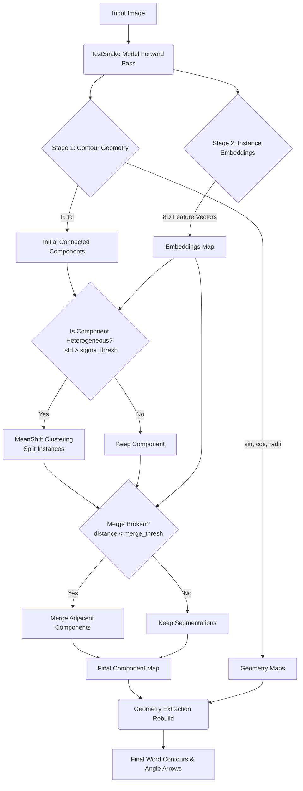

# TextSnake Localization

This repository contains the training and inference pipeline for text localization based on the TextSnake model.

## Features & Enhancements
This implementation includes several custom improvements over the base TextSnake architecture:
- **Angle and Orientation Visualization**: Automatically visualizes the predicted text direction using directional arrows drawn along the text center lines (TCL), derived directly from the model's dense `sin` and `cos` map predictions.
- **Tighter Text Contours**: Improved post-processing step that fixes the "bulging" or "ballooning" effect, ensuring the predicted reconstructed polygons tightly adhere to text boundaries without extraneous background.
- **Optimized Anchor Alignment**: Adjusted anchor box generation logic and matching strategies to strictly align with WordSup specifications (e.g., specific anchor sizes and aspect ratios).
- **Enhanced Inference Pipeline**: Custom inference scripts integrated with end-to-end timing metrics and streamlined visualization utilities for rapid testing.

## Model Inference Flow & Clustering

This repository implements a robust, two-stage hybrid inference pipeline specifically designed to separate closely packed text instances:
1. **Stage 1 (Contour Geometry Extraction)**: The model performs a forward pass to extract dense prediction maps: Text Region (`tr`), Text Center Line (`tcl`), `sin`, `cos`, and `radii` maps. The base intersecting regions between `tr` and `tcl` are extracted as initial connected components.
2. **Stage 2 (Embedding-based Correction with MeanShift)**: A parallel branch extracts dense Instance Embeddings (8-dimensional feature vectors per pixel). 
   - **Splitting Heterogeneous Instances**: The pipeline computes the variance of embeddings within each initial connected component. If the standard deviation exceeds a certain threshold (e.g. `sigma_thresh = 0.45`), the component is considered heterogeneous. In this case, **MeanShift Clustering** is applied dynamically over the embedding vectors corresponding to the pixels of that component to slice it into distinct text instances.
   - **Merging Broken Instances**: Spatially adjacent components are compared. If the Euclidean distance between their mean embedding vectors is less than `merge_thresh`, they are unified back into a single text instance. 
   - After this clustering and merging correction, geometric contour extraction correctly rebuilds individual word instances avoiding erroneous merging between neighboring text lines or breaking them unintentionally.



## Quick Start

The main entry point for the training and testing workflow is the `run_pipeline.sh` script. 

```bash
./run_pipeline.sh
```

This script will:
1. Train the TextSnake model on your custom dataset (`train_textsnake_mod.py`).
2. Run inference on a batch of test images and generate predicted text visualizations (`inference_custom.py`).

*Note: Before running, update `DATA_ROOT` and `TEST_IMGS` in `run_pipeline.sh` to point to your dataset and testing folders.*

## Key Scripts

- **`train_textsnake_mod.py`**: The training script. It handles data augmentation, custom dataloading, and model checkpoints.
- **`inference_custom.py`**: The inference script. It runs given test images through the trained model, performs post-processing on the geometry maps, and outputs bounding polygon visualisations.
- **`eval_textsnake.py`**: Evaluation script used for generating detection metrics like Precision, Recall, and F-measure via the DetEval protocol.
- **`util/`**: Contains utility functions for configuration (`config.py`), visualizations (`visualize.py`), data augmentation, and text center line post-processing (`detection.py`).

## Running Inference Independently

If you already have pre-trained weights (e.g., `best.pth`) and only want to perform inference and view the visualizations, you can invoke the inference script directly. Make sure you are using the correct conda environment (e.g. `conda activate textsnake`).

```bash
python inference_custom.py \
    --exp_name "custom_training_enhanced" \
    --model_path "best.pth" \
    --img_path "images_test" \
    --output_dir "newlogs/inference_test"
```

## Directory Structure
- **`images_test/`**: Folder containing sample images for inference testing.
- **`newlogs/save/`**: The default location where training checkpoints (like `best.pth`) are stored.
- **`newlogs/inference_test/`**: The default location where the inference visualizations are saved after running inference.
